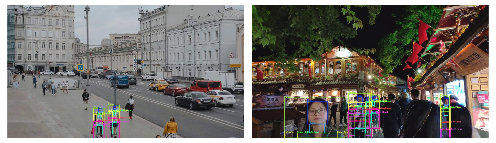

# Limb-by-Limb Fashion Analysis: A Novel Approach to Garment and Body Part Detection in Images

## Overview
This repository contains the research paper supplementary materials for our study on body and garment parts detection and analysis utilizing computer vision techniques. Our work introduces a novel approach to identify and segment specific body parts and clothing items within images, which is vital for understanding current fashion trends and assisting in the creation of fashion recommendation systems.


Proposed model architecture


Pixel intensity evaluation for person localisation.

[comment]: <> (## Research Paper)

[comment]: <> (The paper details the development and validation of a computational framework that combines traditional face detection algorithms, like Haarcascade, with advanced methods such as YOLOv9 and fully connected Convolutional Neural Networks &#40;CNNs&#41;. The methodology is rigorously tested across multiple datasets to ensure accuracy and robustness in various scenarios, including high-fashion contexts and everyday street scenes.)

## Methodology
The core of our methodology is a multi-stage process that includes:
- Face detection using Haarcascade and YOLOv9
- Verification of detected faces with a fully connected CNN
- Person detection in images using novel Pixel Intensity based model and yolov9.
- Fashion frame detection to isolate and analyze garment and body part features

## Datasets
The study utilizes several publicly available datasets, such as Fashionpedia, DARN, and Fashion10000, providing a diverse range of images for analysis. Real-time videos and images from sources like Pexels are also included to demonstrate the model's practical applications.

## Environment Variables

To run this project, you will need to change the following variables to your config.py file

`harcascade_classifier_path`  # Path where haarcascade is resides.

`cnn_model_path`  # Path where Fully Connected trained model resides.

`yolo_face_detection_model_path`  # Path where yolo face-detection model resides.

`yolo_person_detection_model_path`  # Path where yolo person-detection model resides.

`device=torch.device("cpu")` # change to gpu if you have gpu enabled devide.

`TEMP_DIR` # Directory to store temporary files.

`EVAL_DIR` # Directory to store evaluation files.

`RAW_DIR_NAME` # Raw files while using YOLOv9

## Installation

Python 3.9

```bash
  pip install -r requirement.txt
  python main.py
```


## Results

Comparison results generated by our model with Haarcascade and YOLOv9 with Fully-connected CNN.


Real time results.

Our findings indicate a significant improvement in the detection of fashion-related elements in images, with a particular enhancement noted in the accuracy of face detection and the subsequent body part segmentation.

## Conclusion
This research contributes to the advancement of fashion-oriented computer vision applications, demonstrating the potential for automated analysis of fashion elements in images. The methods developed herein hold promise for diverse applications, from trend prediction to retail strategy and security.

[comment]: <> (## Citation)

[comment]: <> (If you use the methodology or data presented in this study, please consider citing our paper. The BibTeX entry is provided for convenience:)

[comment]: <> (```bibtex)

[comment]: <> (@article{your_paper_title,)

[comment]: <> (  title={Your Paper Title},)

[comment]: <> (  author={Your Name and Co-authors},)

[comment]: <> (  journal={Where It Is Published},)

[comment]: <> (  year={The Year of Publication},)

[comment]: <> (  publisher={The Publisher})

[comment]: <> (})
